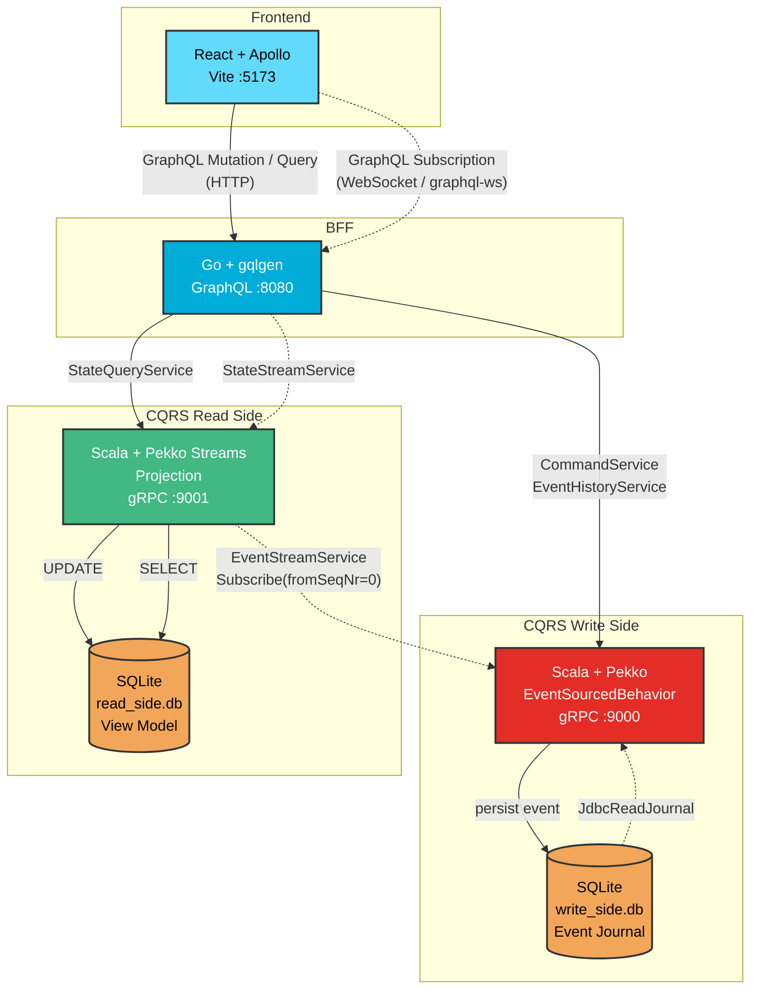
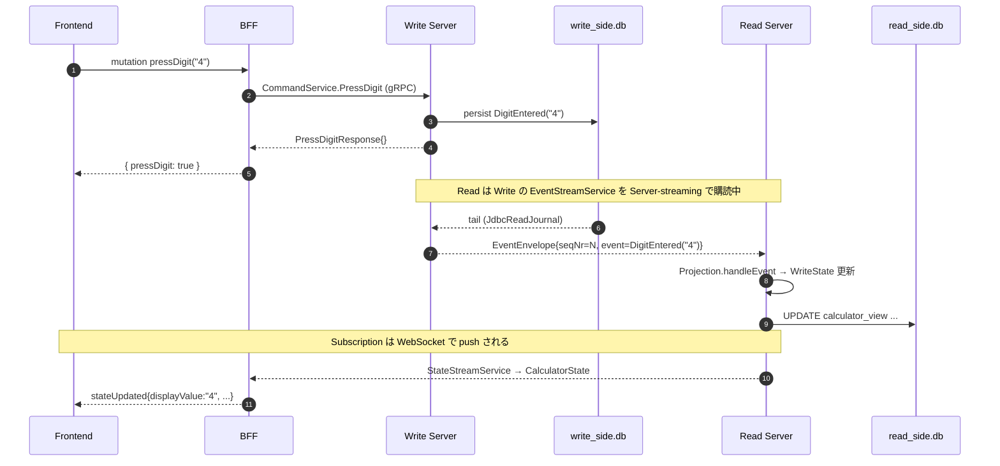

# Dentaku CQRS + Event Sourcing

CQRS (Command Query Responsibility Segregation) と Event Sourcing を「古い電卓」のドメインを通じて体験するための分散システム。

## 📐 アーキテクチャ



凡例: **実線** = Unary RPC / 短いリクエスト, **点線** = Server-streaming / WebSocket (long-lived push)

## 通信プロトコル

| 区間 | プロトコル | 備考 |
|---|---|---|
| Frontend ↔ BFF (Mutation/Query) | GraphQL over HTTP | Apollo Client |
| Frontend ↔ BFF (Subscription) | GraphQL over WebSocket | `graphql-ws` (graphql-transport-ws) |
| BFF → Write / Read | gRPC (h2c) | `pekko.http.server.preview.enable-http2 = on` |
| Read → Write (Event 購読) | gRPC server-streaming | `EventStreamService.Subscribe` |
| Write 内部 | Pekko Persistence Query (`JdbcReadJournal`) | journal を tail して gRPC に流す |

## ディレクトリ構成

```
calc-cqrs-es/
├── proto/                          共有スキーマ (gRPC + Event 定義)
│   ├── buf.yaml / buf.gen.yaml
│   └── calc/v1/
│       ├── events.proto            CalcEvent (oneof) / EventEnvelope / CalculatorState
│       ├── write_service.proto     CommandService / EventStreamService / EventHistoryService
│       └── read_service.proto      StateQueryService / StateStreamService
├── dentaku-write-server/           Scala 3 + Pekko (EventSourcedBehavior + JDBC journal)
├── dentaku-read-server/            Scala 3 + Pekko Streams (gRPC subscribe + projection)
├── dentaku-bff/                    Go + gqlgen + grpc-go
├── dentaku-frontend/               React + Apollo + graphql-ws (Vite)
└── Makefile                        make generate / make lint-proto
```

## 🧩 イベントソーシングの構造

### 永続化されるイベント (Aggregate `persistenceId = "calc-1"`)
- `DigitEntered(digit)` — 数字キー押下
- `OperatorSelected(operator)` — `+ - * /` 押下
- `Calculated(result)` — `=` 押下時の評価結果
- `Cleared` — `C` 押下
- `Undone` — Undo の補償イベント

### 状態の再構築
- **Write**: `EventSourcedBehavior` がジャーナルからイベントを replay → `WriteState` を構築
- **Read**: 毎起動で `read_side.db` を drop/recreate → Write の `EventStreamService.Subscribe(fromSeqNr=0)` でジャーナル全件を受信 → `Projection.handleEvent` で in-memory state と DB を更新

「常に初期状態から再生」アプローチで冪等性を担保しており、別途オフセット管理テーブルは不要。

### Undo
- 各イベント適用時に `WriteState.history: List[WriteState]` へスナップショットを push
- `Undone` 適用時に `history.head` を pop して状態を復元
- 過去イベントは物理削除せず、`Undone` を append する（補償イベント方式）

### チェイン評価
- `1 + 2 * 3 =` のような連続操作は、`*` 押下の時点で `1 + 2 = 3` を確定し、続く `*` を新しい op として保持する（古典的なポケット電卓の挙動）
- 実装は `Calculator.scala:handleEvent` (Write) と `Projection.scala:handleEvent` (Read) の **両方** に重複している（学習用 / 共有モジュール化は将来課題）

## 🚀 ローカル起動

### 必要なツール
- `sbt` (Scala 3.3.x)
- Go 1.26+
- Node.js 20+
- 任意: `buf` (proto 再生成時のみ) — `brew install buf`

### サーバ起動（別ターミナル 4 つ）

```sh
# 1. Write Server (gRPC :9000)
cd dentaku-write-server && sbt run

# 2. Read Server (gRPC :9001)
cd dentaku-read-server && sbt run

# 3. BFF (HTTP / WebSocket :8080)
cd dentaku-bff && go run .

# 4. Frontend (Vite :5173)
cd dentaku-frontend && npm install && npm run dev
```

ブラウザで http://localhost:5173 を開いて電卓を操作。
GraphQL Playground は http://localhost:8080/。

### proto コードの再生成（スキーマを変更した場合）
```sh
make generate     # Go コードを dentaku-bff/internal/pb/calc/v1/ に出力
make lint-proto   # buf lint
```
※ Scala 側は sbt の pekko-grpc プラグインがビルド時に自動生成するため `make generate` は不要。

### 環境変数 (BFF)
| 変数 | デフォルト |
|---|---|
| `PORT` | `8080` |
| `WRITE_GRPC_ADDR` | `localhost:9000` |
| `READ_GRPC_ADDR` | `localhost:9001` |
| `PERSISTENCE_ID` | `calc-1` |

## 📜 GraphQL スキーマ抜粋

```graphql
interface CalcEvent { id: ID!; timestamp: String! }

type DigitEntered     implements CalcEvent { id: ID! timestamp: String! digit: String! }
type OperatorSelected implements CalcEvent { id: ID! timestamp: String! operator: String! }
type Calculated       implements CalcEvent { id: ID! timestamp: String! result: String! }
type Cleared          implements CalcEvent { id: ID! timestamp: String! }
type Undone           implements CalcEvent { id: ID! timestamp: String! }

type CalculatorState {
  displayValue: String!
  storedValue: Float
  currentOp: String
  isNewInput: Boolean!
}

type Query {
  currentState: CalculatorState!
  eventHistory: [CalcEvent!]!
}

type Mutation {
  pressDigit(digit: String!): Boolean!
  pressOperator(operator: String!): Boolean!
  pressEquals: Boolean!
  pressClear: Boolean!
  undo: Boolean!
}

type Subscription {
  stateUpdated: CalculatorState!
}
```

## 🔄 コマンド一周のフロー



## ⚠️ 既知の制約 / 改善余地

- Aggregate は単一固定 (`calc-1`)、マルチユーザー / マルチセッション非対応
- `handleEvent` のロジックが Write と Read の両側で手動コピー (シリアライズで型を渡しているのでズレやすい)
- gRPC クライアントの再接続戦略は grpc-go / pekko-grpc のデフォルトに依存
- Read プロジェクションのオフセットは保持していない (毎起動で seq 0 から replay)
- 認証・認可は未実装
- gRPC long-lived stream のため `pekko.http.{server,client}.idle-timeout = infinite` を設定している (production 用途では keep-alive ping ベースに移行すべき)
